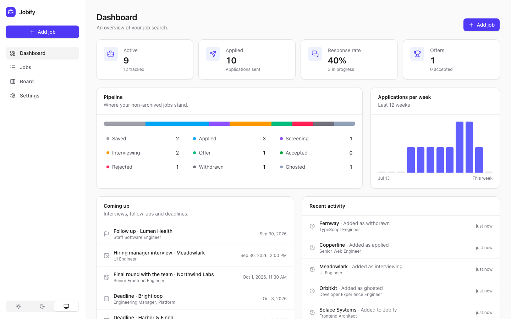
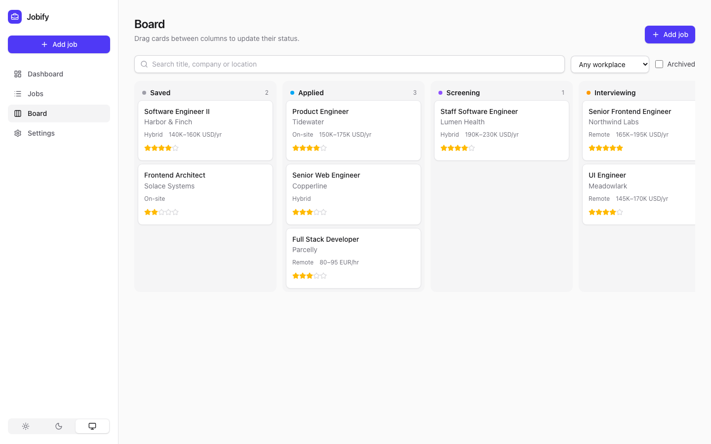
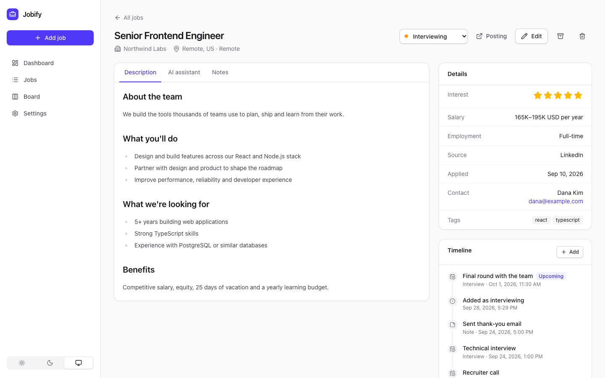
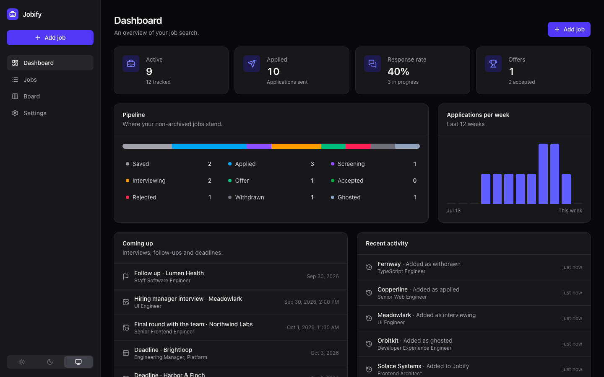

<p align="center">
  
</p>

<h1 align="center">Jobify</h1>

<p align="center">A self-hosted tracker for your job applications.</p>

<p align="center">
  
</p>

Jobify keeps your whole job search in one place: the postings you are interested in, where each
application stands, upcoming interviews and follow-ups, and your notes. It runs as a single Docker
container with an embedded SQLite database, so there is nothing else to set up.

<table>
  <tr>
    <td></td>
    <td></td>
    <td></td>
  </tr>
</table>

## Features

- **Track everything that matters.** Title, company, location, remote/hybrid/on-site, employment
  type, salary range, source, contact, tags, notes, an interest rating and the full description.
- **Status pipeline.** Saved → Applied → Screening → Interviewing → Offer → Accepted, plus Rejected,
  Withdrawn and Ghosted. Every status change is recorded on the job's timeline automatically.
- **List and board views.** Search, filter and sort a table of jobs, or drag cards between columns
  on a Kanban board.
- **Timeline.** Log interviews, notes and follow-ups against each job. Upcoming interviews,
  follow-up dates and deadlines show up on the dashboard.
- **Dashboard.** Active applications, response rate, offers, your pipeline at a glance and
  applications per week.
- **Import from job sites.** Paste a link and Jobify fills in the form. Dedicated importers for
  LinkedIn, Workday, Greenhouse, Lever, Ashby and SmartRecruiters, plus a generic importer that
  understands the structured data most career pages publish. For pages behind a login you can
  paste the page source or text instead.
- **Optional AI assistant.** Connect Anthropic (Claude), OpenAI, Google Gemini, a local Ollama
  model or any OpenAI-compatible API to summarize postings, tidy up descriptions, draft cover
  letters, prepare for interviews and extract job details from any page.
- **Your data, portable.** Export everything as JSON (and import it again) or as a CSV spreadsheet.
- **Optional password** protection, a dark mode, and a layout that works on phones.

## Quick start

### Docker Compose

```yaml
services:
  jobify:
    image: ghcr.io/esg450/jobify:latest
    container_name: jobify
    restart: unless-stopped
    ports:
      - '3000:3000'
    volumes:
      - ./data:/data
    environment:
      PUID: 1000
      PGID: 1000
      # JOBIFY_PASSWORD: change-me
```

```sh
docker compose up -d
```

Then open <http://localhost:3000>.

### Docker

```sh
docker run -d --name jobify \
  -p 3000:3000 \
  -v /path/to/jobify-data:/data \
  -e PUID=1000 -e PGID=1000 \
  ghcr.io/esg450/jobify:latest
```

### Unraid

A template is included at [`unraid/jobify.xml`](unraid/jobify.xml). Copy it to
`/boot/config/plugins/dockerMan/templates-user/` on your server, then choose **Add Container** in
the Docker tab and pick **Jobify** from the template list. Data is stored in
`/mnt/user/appdata/jobify` and the container runs as `99:100` (`nobody:users`) by default.

### Build from source

```sh
git clone https://github.com/esg450/jobify.git
cd jobify
docker build -t jobify .
```

### Updating

Images are published to the GitHub Container Registry for `amd64` and `arm64`:

| Tag            | What it is                                               |
| -------------- | -------------------------------------------------------- |
| `latest`       | The newest release. Recommended.                         |
| `1.2.3`, `1.2` | A specific release, if you want to pin a version.        |
| `edge`         | The current `main` branch, for trying unreleased changes |

On Unraid, new releases appear as **update ready** in the Docker tab; click it to update. With
Compose, run `docker compose pull && docker compose up -d`. Your data is kept across updates and
database migrations run automatically. The running version is shown on the Settings page.

## Configuration

All settings are optional environment variables.

| Variable          | Default         | Description                                                                                 |
| ----------------- | --------------- | ------------------------------------------------------------------------------------------- |
| `PORT`            | `3000`          | Port the web server listens on.                                                             |
| `DATA_DIR`        | `/data`         | Directory for the SQLite database.                                                          |
| `PUID` / `PGID`   | `1000` / `1000` | User and group the container runs as. The data directory is handed to this user on startup. |
| `JOBIFY_PASSWORD` | _unset_         | When set, Jobify asks for this password before showing anything.                            |
| `AI_PROVIDER`     | _unset_         | Default AI provider: `anthropic`, `openai`, `gemini`, `ollama` or `openai_compatible`.      |
| `AI_MODEL`        | _unset_         | Default model. Anthropic defaults to `claude-opus-5-5`; other providers need a model name.  |
| `AI_API_KEY`      | _unset_         | API key for the provider.                                                                   |
| `AI_BASE_URL`     | _unset_         | Custom API endpoint, e.g. `http://192.168.1.10:11434` for Ollama.                           |

AI settings can also be managed from the **Settings** page; settings saved there take precedence
over the environment variables.

## AI providers

| Provider              | What you need                                                                                    |
| --------------------- | ------------------------------------------------------------------------------------------------ |
| Anthropic (Claude)    | An API key from the [Anthropic Console](https://console.anthropic.com/).                         |
| OpenAI                | An API key and a model name.                                                                     |
| Google Gemini         | An API key from Google AI Studio and a model name.                                               |
| Ollama                | A running Ollama server and a model you have pulled. Point the base URL at it.                   |
| OpenAI-compatible API | The API's base URL (for example OpenRouter, Groq, LM Studio or vLLM), a model and usually a key. |

Add your resume and what you are looking for under **Settings → Your profile** to get cover letters
and interview prep tailored to you. Job details and your profile are sent to the provider you
choose, and nowhere else.

## Importing jobs

Paste a posting URL on the **Add job** page. Jobify tries the importer for that site first, then
falls back to the schema.org `JobPosting` data that most career sites embed, and finally to the
page's title and main content. You always get to review the result before saving.

Some sites block automated requests or require you to sign in. In that case switch to **Paste** and
paste the page source (View Source → Select all → Copy) or just the posting text. With an AI
provider configured, Jobify can extract the details from plain text too.

Want to support another site? Importers are small, self-contained classes; see
[CONTRIBUTING.md](CONTRIBUTING.md#adding-a-job-site-importer).

## Security

- Jobify is built for a single user. If it is reachable from outside your home network, set
  `JOBIFY_PASSWORD` and put it behind a reverse proxy with HTTPS.
- The server fetches the URLs you import. Anyone who can use your Jobify instance can make it
  request web pages, which is another reason to set a password on exposed instances.
- API keys are stored in the database in your data directory and are never sent to the browser.

## Backups

Everything lives in `jobify.db` in the data directory; back up that directory, or use
**Settings → Your data** to download a JSON backup or a CSV spreadsheet.

## Development

Requirements: Node.js 24 and npm.

```sh
npm install
npm run dev        # API on :3000 and the web app on http://localhost:5173
```

| Command                              | What it does                                 |
| ------------------------------------ | -------------------------------------------- |
| `npm run dev`                        | Run the API and web app with live reload     |
| `npm test`                           | Run the test suite                           |
| `npm run lint` / `npm run format`    | Lint / format the code                       |
| `npm run typecheck`                  | Type-check both apps                         |
| `npm run build`                      | Production build of both apps                |
| `npm run db:generate -w apps/server` | Create a migration after changing the schema |

The stack is [NestJS](https://nestjs.com/) with [Drizzle ORM](https://orm.drizzle.team/) on
SQLite for the API, and [React](https://react.dev/) with [Vite](https://vite.dev/),
[TanStack Query](https://tanstack.com/query) and [Tailwind CSS](https://tailwindcss.com/) for the
web app. See [CONTRIBUTING.md](CONTRIBUTING.md) for how the code is organised.

## License

Jobify is released under the [PolyForm Noncommercial License 1.0.0](LICENSE). You are free to use,
self-host, modify and share it for any noncommercial purpose, including tracking your own job
search. You may not sell it or use it for commercial purposes. Because of this restriction the
project is source-available rather than "open source" in the OSI sense.
